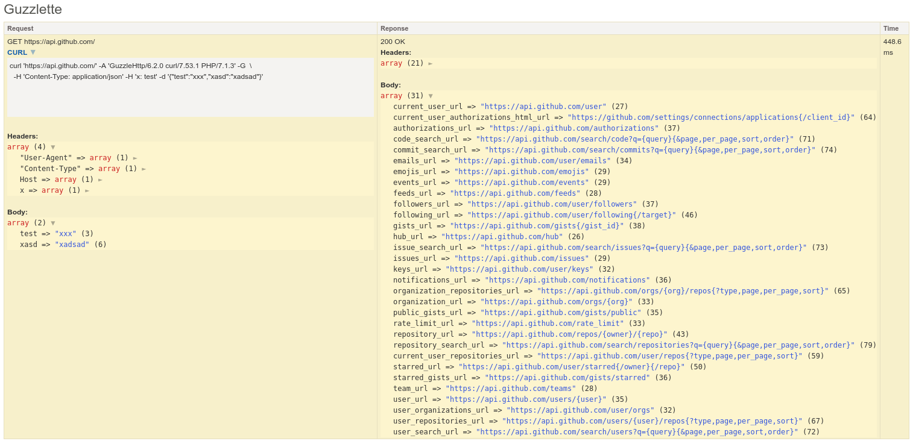

<p align=center>
  <a href="https://github.com/contributte/guzzlette/actions"></a>
  <a href="https://coveralls.io/r/contributte/guzzlette"></a>
  <a href="https://packagist.org/packages/contributte/guzzlette"></a>
  <a href="https://packagist.org/packages/contributte/guzzlette"></a>
</p>
<p align=center>
  <a href="https://packagist.org/packages/contributte/guzzlette"></a>
  <a href="https://github.com/contributte/guzzlette"></a>
  <a href="https://bit.ly/ctteg"></a>
  <a href="https://bit.ly/cttfo"></a>
  <a href="https://contributte.org/partners.html"></a>
</p>

<p align=center>
Website 🚀 <a href="https://contributte.org">contributte.org</a> | Contact 👨🏻‍💻 <a href="https://f3l1x.io">f3l1x.io</a> | Twitter 🐦 <a href="https://twitter.com/contributte">@contributte</a>
</p>

Guzzlette integrates [Guzzle](https://github.com/guzzle/guzzle) HTTP client into Nette Framework applications.

<p align=center>
  
  
</p>

## Versions

| State       | Version | Branch   | Nette | PHP     |
|-------------|---------|----------|-------|---------|
| dev         | `^3.4`  | `master` | 3.0+  | `>=8.0` |
| stable      | `^3.3`  | `master` | 3.0+  | `>=8.0` |

## Installation

To install latest version of `contributte/guzzlette` use [Composer](https://getcomposer.org).

```bash
composer require contributte/guzzlette
```

Register Guzzlette extension in your NEON configuration.

```neon
extensions:
	guzzle: Contributte\Guzzlette\DI\GuzzleExtension
```

## Configuration

```neon
guzzle:
	debug: %debugMode%
	tracy: %debugMode%
	preset: default
	app: MyApp/1.0
	logger:
		level: info
		formatter: "[{method}] {uri} {code}"
		# logger: @Psr\Log\LoggerInterface
	client: # config for GuzzleHttp\Client
		timeout: 30
```

## Implementation

Get Guzzle from DIC instead of creating a new one.
Everything else is in [Guzzle documentation](https://docs.guzzlephp.org/).

```php
use Contributte\Guzzlette\ClientFactory;
use GuzzleHttp\Client;
use Nette\Application\UI\Presenter;

class ExamplePresenter extends Presenter
{
	private Client $guzzle;

	public function injectGuzzle(Client $guzzle): void
	{
		$this->guzzle = $guzzle;
	}

	// Alternatively you could create new instance through ClientFactory.
	public function injectGuzzleFactory(ClientFactory $factory): void
	{
		$this->guzzle = $factory->createClient([
			'timeout' => 30,
		]);
	}

	public function injectGuzzleBuilder(ClientFactory $factory): void
	{
		$this->guzzle = $factory
			->create()
			->withBaseUri('https://api.example.com')
			->withHttpAuth('john', 'doe')
			->build();
	}
}
```

## Development

See [how to contribute](https://contributte.org) to this package. This package is currently maintained by these authors.

<a href="https://github.com/f3l1x">
    
</a>

-----

Consider to [support](https://contributte.org/partners) **contributte** development team.
Also thank you for using this package.
